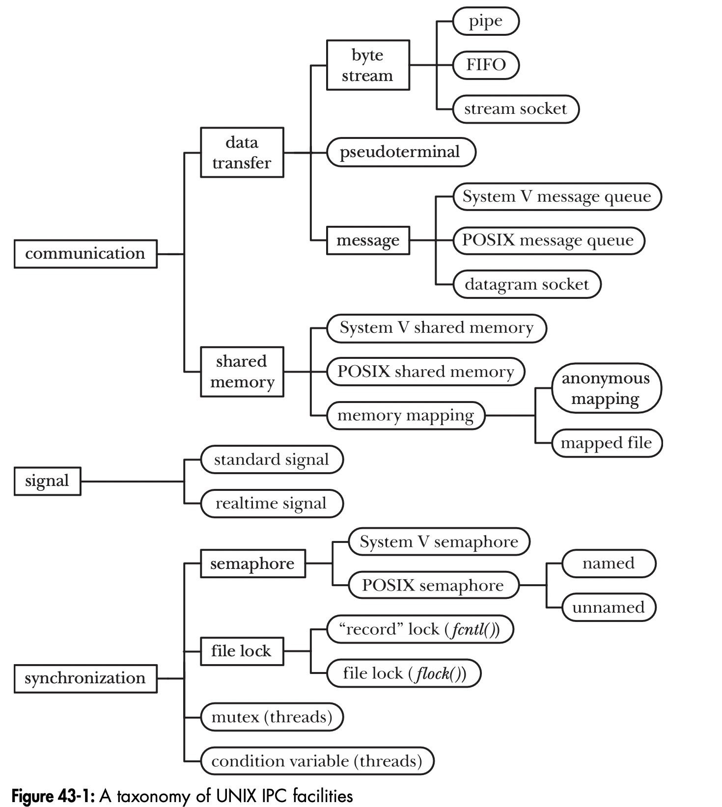

## Ch.43 Inter-Process Communication

---

## 43.1 Taxonomy of IPC


Note:
Similar facilities across different UNIX variants
- System V IPC facilities, POSIX IPC facilities, BSD IPC facilities
POSIX IPC (shared memory, message queue, semaphore) improves System V IPC
- FIFO (System V) only for local processes communication; Stream Socket (BSD) can communicate over network

---

## 43.2 Communication Facilities

Note:
exchanging data between process

--

### Data-transfer facilities


- One process writes data to IPC facility (user memory to kernel memory)
- The other process reads from it (kernel memory to user memory)
- advantage: no synchronization required
- disadvantage: slow (from/to kernel), destructive read

#### Byte stream
- Pipe, FIFO, stream socket
- Read and write arbitrary size of blocks in bytes
- UNIX "File as a sequence of bytes" model

#### Message
- System V message queue, POSIX message queue, datagram sockets
- Read and write by delimited message
- Each read operation reads a whole message, as written by the writer process

#### Pseudoterminals
Provide details in Ch. 64

Note:
- file as a sequence of bytes
    - file is a finite length sequence of bytes
- pseudoterminals
    - deal with immediately write to kernel buffer rather than stdio buffer for pipe

--

### Shared memory


- System V shared memory, POSIX shared memory, memory mappings
- Comparasons in section 54.5
- Placing information in a shared memory region
- No system calls or transfering between user memory and kernel memory
- advantage: fast, non-destructive read
- disadvantage: synchronization required

---

## Data-transfer vs shared memory
Data-transfer facilities
- CAN have many readers but reads are destructive
- MSG_PEEK flag: non-destructive read from socket (section 61.3)
- UDP socket: broadcast or multicast single message to multiple recipients

---

## 43.3 Synchronization Facilities

Note:
synchronizing actions between processes or threads

--

### Semaphores
- System V semaphores, POSIX semaphores
- kernel-maintained integer
- will not be smaller than 0
- semaphore value
    - decrements when a process is operating on the shared resource
    - increments when a shared resource is released by process
- blocking: kernel blocks operation until operation being permitted
- non-blocking: immediately returning error if operation not permitted

### File locks
- read(shared) locks
    - n process can have 1 read lock to a file
- write(exclusive) locks
    - Only 1 process can have 1 read lock and 1 write lock
- flock()
    - Simple but rarely used as it locks entire file
- fcntl()
    - Can lock by file regions

### Mutexes and condition variables
- Talked in ch.30
- Mutex and condition variables shared between processes
    - Linux with *glibc* providing NPTL threading implementation

Communication facilities can also be used for synchronization. We'll see an example in Section 44.3.

Note:
binary semaphore vs mutex
```markdown
| | semaphore | mutex |
|-|-|-|
| mechanism | signaling | locking |
| function | multiple resources | single resource |
| what is it | integer | object |
| type | counting semaphore, binary semaphore | x |
| access permission | any process can update semaphore value | only the owner of lock can release it |
| how | wait(), signal() | acquire(), release() |
```

---

## 43.4 Comparing IPC Facilities


Note:
Compare name and handle of System V and POSIX

--

### Communication
* Data-transfer facilities: byte stream or message-oriented
* System V and POSIX message queues
    * type: can assign numeric type or priority to rearrange which message being handled first
* Pipes, FIFOs, stream sockets: file descriptors: can use select(), poll(), epoll() to monitor multiple file descriptors to see which I/O is available
* POSIX message queue: provides notification facility, allowing sending signal or instantiate a new thread when message is added to the queue
* UNIX domain sockets: pass file descriptor from one process to another. (Section 61.13.3)
* UDP sockets: sender can broadcast or multicast a message to multiple recipients

### Process synchronization
* fcntl(): record lock is owned by the process. kernel will throw error if there is deadlock
* record lock will release automatically when process terminates
    * System V has "undo" feature but not reliable
    * POSIX semaphores do not have this feature
* System V and POSIX semaphores don't have ownership property so no deadlock detection

### Network communication
In Figure 43-1, only sockets permit processes communicate over network
Sockets allow processes on different hosts connected via TCP/IP network.

Convert from UNIX domain socket to Internet domain socket is easy.

```cpp [5-8|10-13]
#include <sys/socket.h>

...

// Create a UNIX domain socket
struct sockaddr_un servaddr;

sockfd = socket(AF_UNIX, SOCK_STREAM, 0);

// Create a internet domain socket
struct sockaddr_n servaddr;

sockfd = socket(AF_INET, SOCK_STREAM, 0);

...
```

### Portability
* POSIX IPC facilities are not widely available as System V IPC
* ex. POSIX message queue and semphores only supported in Linux 2.6.x kernel series
* So System V IPC is more preferable to POSIX IPC

### System V IPC design issues
* Complicated programming interface
    * No handle(like file descriptor) for an open IPC object so developers need to maintain reference count of the object to know if it can be deleted
* Incompatible with UNIX I/O model
    * System V IPC uses integer key values and IPC id rather than pathnames and file descriptors.

POSIX IPC improves the above issues.


### Accessibility
* permissions mask: FIFO, sockets: file permissions mask
    System V IPC objects: permissions mask similar to file
* related: pipes, anonymous memory mappings; one process creates object and must fork() so child process can access it
* No restrictions on accessing Internet domain socket

### Persistence
* Process persistence
    * at least 1 process holds the IPC object
    * Pipes, FIFOs, sockets
* Kernel persistence
    * explicitly delete IPC object
    * system shuts down
    * System V IPC, POSIX IPC
* File-system persistence
    * explicitly delete IPC object
    * Shared-memory

### Performance
No comparison since
* not significant
* vary across UNIX implementations, versions
* context switch, amount of data, etc.
* Need to abstract IPC facilities from applications to test performance
