<h2 class="custom-center">
	TLPI - Ch.44 Pipes and FIFOs
</h2>

---

## 44.1 Overview
How can the shell allow the output produced by one process to be used as the input to the other process?

* FIFOs are a variation on the pipe concept
* FIFOs can be used for communication between ANY processes
* Pipes can be used for only related processes

```auto []
ls | wc -l
```

The shell creates two processes, executing `ls` and `wc` respectively. This is done with fork() and exec().

Figure 44-1 shows how the two processes employ the pipe

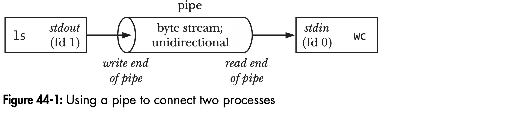

Both writing and reading processes are unaware of the existence of pipe.
The writing process (ls) writes to stdout and the reading process (wc) reads from stdin.
The shell uses pipes to connect filters. (Section 44.4)

--

### A pipe is a byte stream
* no concept of messages or message boundaries
* pipe can read blocks of data of any size, independent of the size of blocks written by the writing process
* bytes read from the pipe sequentially, not possible to randomly access the data in a pipe using *lseek()*

--

### Reading from a pipe
* process reading from the pipe will see end-of-file (read() returns 0) if write end of the pipe is closed

--

### Pipes are unidirectional
One end of the pipe is only used for reading and the other writing

System V provides bidirectional pipes but they are not specified by any UNIX standards. Please avoid using it.
Instead, UNIX domain stream socket pairs (*socketpair()*, Section 57.5) provide a standardized bidirectional communication mechanism equivalent to stream pipes.

--

### Writes of up to PIPE_BUF bytes are guaranteed to be atomic
* SUSv3: PIPE_BUF should be greater than or equal to _POSIX_PIPE_BUF (512)
* Implementation should define PIPE_BUF (<limits.h>) and fpathconf(fd, _PC_PIPE_BUF) to return the actual upper limit for atomic writes

--

#### Writing data no more than PIPE_BUF
If multiple processes are writing to a pipe, it is guaranteed their data won't be intermingled if no more than PIPE_BUF bytes at a time.

--

#### Writing data more than PIPE_BUF
Kernel may transfer the data in multiple smaller pieces (smaller than PIPE_BUF). The segments size is arbitrary and the segments read from different processes may be interleaved.

--

##### Partial write
If interrupted by signal handler, the write() unblocks and returns a count of the number of bytes transferred, which will be less than requested

Linux2.2: pipe writes of any size are atomic
> Linux2.4: pipe writes > PIPE_BUF bytes may be interleaved with writes by other processes

--

#### Pipes have a limited capacity
Pipe is simply a buffer maintained in kernel memory.
The pipe blocks once it is full until the reader removes some data from the pipe.

> Linux2.6.11, the pipe capacity is 65,536 bytes.

In theory, pipe can work even with a single-byte buffer. The advantage of using large buffer is efficiency. Whenever the pipe is full, kernel needs to context switch to allow the reader to be scheduled to empty some data from the pipe. Large buffer reduces the frequency of context switch.

> Linux2.6.35, capacity of a pipe can be modified using fcntl(fd, F_SETPIPE_SZ, size).

The size can be between system page size and pipe max size (/proc/sys/fs/pipe-max-size). The default value is 1,048,576 bytes.

Use fcntl(fd, F_GETPIPE_SZ) to get the actual size allocated for the pipe.

---

## 44.2 Creating and Using Pipes


* `filedes`: `filedes[0]` for read end, `filedes[1]` for write end

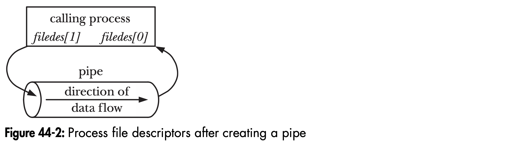

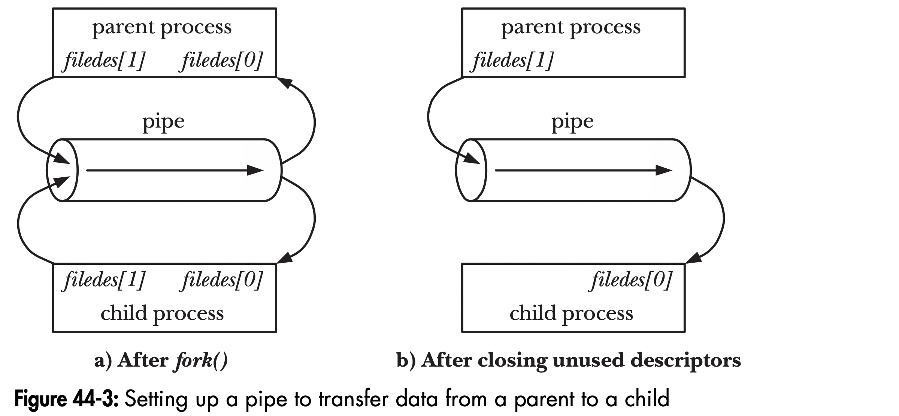


Combo: pipe(), fork()

Listing 44-1: Steps in creating a pipe to transfer data from a parent to a child

```cpp [1-3|8-13|14-19]
 int filedes[2];
 if (pipe(filedes) == -1) /* Create the pipe */
   errExit("pipe");
 switch (fork()) {
   /* Create a child process */
 case -1:
   errExit("fork");
 case 0:
   /* Child */
   if (close(filedes[1]) == -1) /* Close unused write end */
     errExit("close");
   /* Child now reads from pipe */
   break;
 default:
   /* Parent */
   if (close(filedes[0]) == -1) /* Close unused read end */
     errExit("close");
   /* Parent now writes to pipe */
   break;
 }
```

It is unusual for both the parent and child reading from a single pipe because of potential race condition.
One way is to create two pipes, one for reading and the other for writing only. (deadlock: both processes trying to read an empty pipe)

Many writers to one reader is useful on a FIFO (Section 44.8).

Since kernel 2.6.27, Linux supports pipe2() (nonstandard).
It supports flags, `O_CLOEXEC` and `O_NONBLOCK`.

--

### Pipes allow communication between related processes
* A common scenario is to use pipe for communication between two siblings. Their parent creates the pipe and then creates the two children.
* An exception is to pass file descriptor over a UNIX domain socket so the pipe can be used for unrelated process.

--

### Closing unused pipe file descriptors
Why unused file descriptors for both read and write ends of the pipe must be closed?
* avoid exhausting limits of file descriptors
* the reader closes its write file descriptor. As all writers have closed their write descriptor, the reader can see end-of-file or the reader will wait until being interrupted by a signal handler
* the writer closes its read file descriptor. As all readers have closed their writing file descriptors, the writer will receive SIGPIPE signal from the kernel to be killed (or EPIPE error)
* a pipe will be destroyed only after all file descriptors referred to a pipe are closed.

--

### Using a pipe to communicate between a parent and child process

```shell []
$ ./simple_pipe 'It was a bright cold day in April, '\
'and the clocks were striking thirteen.'
It was a bright cold day in April, and the clocks were striking thirteen.
```

--

Listing 44-2: Using a pipe to communicate between a parent and child process

```cpp [20|21-22|27-28|30|34-36|38-46|48-51|53-55|57-58|60-61|62-63]
/* simple_pipe.c

   Simple demonstration of the use of a pipe to communicate
   between a parent and a child process.

   Usage: simple_pipe "string"

   The program creates a pipe, and then calls fork() to create a child process.
   After the fork(), the parent writes the string given on the command line
   to the pipe, and the child uses a loop to read data from the pipe and
   print it on standard output.
*/
#include <sys/wait.h>
#include "tlpi_hdr.h"

#define BUF_SIZE 10
int
main(int argc, char *argv[])
{
    int pfd[2];                             /* Pipe file descriptors */
    char buf[BUF_SIZE];
    ssize_t numRead;

    if (argc != 2 || strcmp(argv[1], "--help") == 0)
        usageErr("%s string\n", argv[0]);

    if (pipe(pfd) == -1)                    /* Create the pipe */
        errExit("pipe");

    switch (fork()) {
    case -1:
        errExit("fork");

    case 0:             /* Child  - reads from pipe */
        if (close(pfd[1]) == -1)            /* Write end is unused */
            errExit("close - child");

        for (;;) {              /* Read data from pipe, echo on stdout */
            numRead = read(pfd[0], buf, BUF_SIZE);
            if (numRead == -1)
                errExit("read");
            if (numRead == 0)
                break;                      /* End-of-file */
            if (write(STDOUT_FILENO, buf, numRead) != numRead)
                fatal("child - partial/failed write");
        }

        write(STDOUT_FILENO, "\n", 1);
        if (close(pfd[0]) == -1)
            errExit("close");
        exit(EXIT_SUCCESS);

    default:            /* Parent - writes to pipe */
        if (close(pfd[0]) == -1)            /* Read end is unused */
            errExit("close - parent");

        if (write(pfd[1], argv[1], strlen(argv[1])) != strlen(argv[1]))
            fatal("parent - partial/failed write");

        if (close(pfd[1]) == -1)            /* Child will see EOF */
            errExit("close");
        wait(NULL);                         /* Wait for child to finish */
        exit(EXIT_SUCCESS);
    }
}
```

---

## 44.3 Pipes as a Method of Process Synchronization

Pieps can be used to coordinate the actions of one process with multiple other related processes.

Multiple signals cannot be queued so it is not suited in this case.

In Listing 44-3 we close the pipe in each child process. There are other ways to notify the parent process
* each child writes a message to the pipe containing its process ID and status information
* each child writes a single byte to the pipe

The parent can count and analyze these messages.

These methods prevent from the child accidentally terminating before closing the pipe.

--

```shell []
$ ./pipe_sync 4 2 6
08:22:16 Parent started
08:22:18 Child 2 (PID=2445) closing pipe
08:22:20 Child 1 (PID=2444) closing pipe
08:22:22 Child 3 (PID=2446) closing pipe
08:22:22 Parent ready to go
```

--

Listing 44-3: Using a pipe to synchronize multiple processes

```cpp [3-6|8-13|20|30-31|33|38|39-40|42-44|46-49|51-53|55-56|60-63|65|67-68|69-73]
/* pipe_sync.c

   Show how pipes can be used for synchronizing the actions of a parent and
   multiple child processes.

   Usage: pipe_sync sleep-time...

   After creating a pipe, the program creates one child for each command-line
   argument. Each child simulates doing some work by sleeping for the number of
   seconds specified in the corresponding command-line argument. When it has
   finished doing its "work", each child closes its file descriptor for the
   write end of the pipe; the parent can see that all children have finished
   their work when it sees end-of-file on the read end of the pipe.
*/
#include "curr_time.h"                      /* Declaration of currTime() */
#include "tlpi_hdr.h"
int
main(int argc, char *argv[])
{
    int pfd[2];                             /* Process synchronization pipe */
    int j, dummy;

    if (argc < 2 || strcmp(argv[1], "--help") == 0)
        usageErr("%s sleep-time...\n", argv[0]);

    setbuf(stdout, NULL);                   /* Make stdout unbuffered, since we
                                               terminate child with _exit() */
    printf("%s  Parent started\n", currTime("%T"));

    if (pipe(pfd) == -1)
        errExit("pipe");

    for (j = 1; j < argc; j++) {
        switch (fork()) {
        case -1:
            errExit("fork %d", j);

        case 0: /* Child */
            if (close(pfd[0]) == -1)        /* Read end is unused */
                errExit("close");

            /* Child does some work, and lets parent know it's done */

            sleep(getInt(argv[j], GN_NONNEG, "sleep-time"));
                                            /* Simulate processing */
            printf("%s  Child %d (PID=%ld) closing pipe\n",
                    currTime("%T"), j, (long) getpid());
            if (close(pfd[1]) == -1)
                errExit("close");

            /* Child now carries on to do other things... */

            _exit(EXIT_SUCCESS);

        default: /* Parent loops to create next child */
            break;
        }
    }

    /* Parent comes here; close write end of pipe so we can see EOF */

    if (close(pfd[1]) == -1)                /* Write end is unused */
        errExit("close");

    /* Parent may do other work, then synchronizes with children */

    if (read(pfd[0], &dummy, 1) != 0)
        fatal("parent didn't get EOF");
    printf("%s  Parent ready to go\n", currTime("%T"));

    /* Parent can now carry on to do other things... */

    exit(EXIT_SUCCESS);
}
```

---

## 44.4 Using Pipes to Connect Filters
How to achieve the communication between `ls` and `wc` (Figure 44-1) without modifying the code of the filters themselves?


The answer is to duplicate the file descriptors

```cpp []
int pfd[2];
pipe(pfd);             /* Allocates (say) file descriptors 3 and 4 for pipe */

/* Other steps here, e.g., fork() */

close(STDOUT_FILENO);  /* Free file descriptor 1 */
dup(pfd[1]);           /* Duplication uses lowest free file
                          descriptor, i.e., fd 1 */
```

If file descriptor 0 is closed before the above steps, we may bind the process's stdin to pipe's write end. Use dup2 to avoid this.

```cpp []
dup2(pfd[1], STDOUT_FILENO);  /* Close descriptor 1, and 
                                 reopen bound to write end of pipe */
```

Then close unneeded file descriptor `pfd[1]`

```cpp []
close(pfd[1]);
```

The above requires stdout is open. If both stdin and stdout are closed, the only wrtie descriptor for write will be closed.

```cpp []
dup2(1, 1); /* Does nothing */
close(1); /* Closes sole descriptor for write end of pipe */
```

So check if `pfd[1]` equals value 1 beforehand is important.

```cpp []
if (pfd[1] != STDOUT_FILENO) {
 dup2(pfd[1], STDOUT_FILENO);
 close(pfd[1]);
}
```

--

```shell []
$ ./pipe_ls_wc
 24
$ ls | wc -l  # Verify the results using shell commands
 24
```

--

Listing 44-4: Using a pipe to connect `ls` and `wc`

```cpp [12-15|17|21-23|27-32|34|35|41|45-47|51-56|58|59|65-74|76]
/* pipe_ls_wc.c

   Demonstrate the use of a pipe to connect two filters. We use fork()
   to create two children. The first one execs ls(1), which writes to
   the pipe, the second execs wc(1) to read from the pipe.
*/
#include <sys/wait.h>
#include "tlpi_hdr.h"
int
main(int argc, char *argv[])
{
    int pfd[2];                                     /* Pipe file descriptors */

    if (pipe(pfd) == -1)                            /* Create pipe */
        errExit("pipe");

    switch (fork()) {
    case -1:
        errExit("fork");

    case 0:             /* First child: exec 'ls' to write to pipe */
        if (close(pfd[0]) == -1)                    /* Read end is unused */
            errExit("close 1");

        /* Duplicate stdout on write end of pipe; close duplicated descriptor */

        if (pfd[1] != STDOUT_FILENO) {              /* Defensive check */
            if (dup2(pfd[1], STDOUT_FILENO) == -1)
                errExit("dup2 1");
            if (close(pfd[1]) == -1)
                errExit("close 2");
        }

        execlp("ls", "ls", (char *) NULL);          /* Writes to pipe */
        errExit("execlp ls");

    default:            /* Parent falls through to create next child */
        break;
    }

    switch (fork()) {
    case -1:
        errExit("fork");

    case 0:             /* Second child: exec 'wc' to read from pipe */
        if (close(pfd[1]) == -1)                    /* Write end is unused */
            errExit("close 3");

        /* Duplicate stdin on read end of pipe; close duplicated descriptor */

        if (pfd[0] != STDIN_FILENO) {               /* Defensive check */
            if (dup2(pfd[0], STDIN_FILENO) == -1)
                errExit("dup2 2");
            if (close(pfd[0]) == -1)
                errExit("close 4");
        }

        execlp("wc", "wc", "-l", (char *) NULL);
        errExit("execlp wc");

    default: /* Parent falls through */
        break;
    }

    /* Parent closes unused file descriptors for pipe, and waits for children */

    if (close(pfd[0]) == -1)
        errExit("close 5");
    if (close(pfd[1]) == -1)
        errExit("close 6");
    if (wait(NULL) == -1)
        errExit("wait 1");
    if (wait(NULL) == -1)
        errExit("wait 2");

    exit(EXIT_SUCCESS);
}
```

Note:
execlp(): The execlp(), execvp(), and execvpe() functions duplicate the actions of the shell in searching for an executable file if the specified filename does not contain a slash (/) character.

dup2(): The dup2() system call performs the same task as dup(), but
    instead of using the lowest-numbered unused file descriptor, it
    uses the file descriptor number specified in newfd.  In other
    words, the file descriptor newfd is adjusted so that it now
    refers to the same open file description as oldfd.

---

## 44.5 Talking to a Shell Command via a Pipe: `popen()`


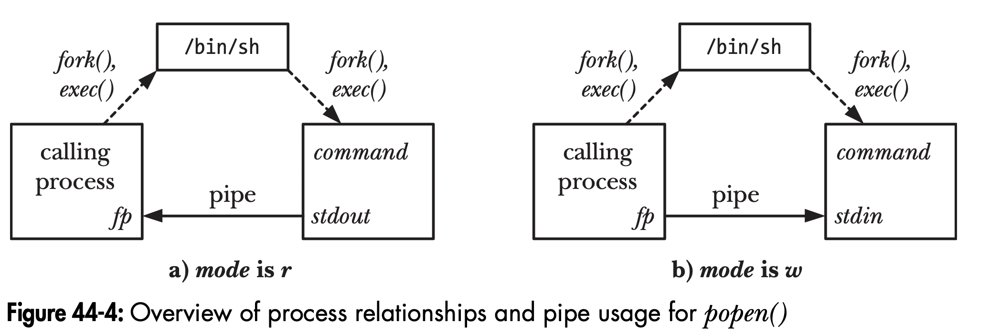

--

### `popen()` vs `system()`
popen()
1. builds the pipe
2. performs descriptor duplication
3. closes unused descriptors
4. handles all of the details of fork() and exec()
    the shell processing is also performed on the command.

But `popen()` is inefficient since at least two processes will be created: shell process and process command executed by the shell.

system(): the execution of the shell command is encapsulated within a single function call
popen(): the calling process runs in parallel with the shell command and then calls pclose()

SUSv3
* `popen()` should handle `SIGINT` and `SIGQUIT` since these signals are sent to both calling process and executed command
* `popen()` should not block `SIGCHLD`. So if calling process is waiting before pclose() call, it can receive -1 with errno set to `ECHILD`

--

```cpp []
$ ./popen_glob
pattern: popen_glob*           Matches two filenames
popen_glob
popen_glob.c
 2 matching files
 pclose() status = 0
 child exited, status=0
pattern: x*                    Matches no filename
 0 matching files
 pclose() status = 0x100       ls(1) exits with status 1
 child exited, status=1
pattern: ^D$                   Type Control-D to terminate
```

--

Listing 44-5: Globbing filename patterns with `popen()`

```cpp [20-25|28-29|30-31|32-53|55-63|65-71|75-79|82]
/* popen_glob.c

   Demonstrate the use of popen() and pclose().

   This program reads filename wildcard patterns from standard input and
   passes each pattern to a popen() call that returns the output from ls(1)
   for the wildcard pattern. The program displays the returned output.
*/
#include <ctype.h>
#include <limits.h>
#include "print_wait_status.h"          /* For printWaitStatus() */
#include "tlpi_hdr.h"

#define POPEN_FMT "/bin/ls -d %s 2> /dev/null"
#define PAT_SIZE 50
#define PCMD_BUF_SIZE (sizeof(POPEN_FMT) + PAT_SIZE)
int
main(int argc, char *argv[])
{
    char pat[PAT_SIZE];                 /* Pattern for globbing */
    char popenCmd[PCMD_BUF_SIZE];
    FILE *fp;                           /* File stream returned by popen() */
    Boolean badPattern;                 /* Invalid characters in 'pat'? */
    int len, status, fileCnt, j;
    char pathname[PATH_MAX];

    for (;;) {                  /* Read pattern, display results of globbing */
        printf("pattern: ");
        fflush(stdout);
        if (fgets(pat, PAT_SIZE, stdin) == NULL)
            break;                      /* EOF */
        len = strlen(pat);
        if (len <= 1)                   /* Empty line */
            continue;

        if (pat[len - 1] == '\n')       /* Strip trailing newline */
            pat[len - 1] = '\0';

        /* Ensure that the pattern contains only valid characters,
           i.e., letters, digits, underscore, dot, and the shell
           globbing characters. (Our definition of valid is more
           restrictive than the shell, which permits other characters
           to be included in a filename if they are quoted.) */

        for (j = 0, badPattern = FALSE; j < len && !badPattern; j++)
            if (!isalnum((unsigned char) pat[j]) &&
                    strchr("_*?[^-].", pat[j]) == NULL)
                badPattern = TRUE;

        if (badPattern) {
            printf("Bad pattern character: %c\n", pat[j - 1]);
            continue;
        }

        /* Build and execute command to glob 'pat' */

        snprintf(popenCmd, PCMD_BUF_SIZE, POPEN_FMT, pat);

        fp = popen(popenCmd, "r");
        if (fp == NULL) {
            printf("popen() failed\n");
            continue;
        }

        /* Read resulting list of pathnames until EOF */

        fileCnt = 0;
        while (fgets(pathname, PATH_MAX, fp) != NULL) {
            printf("%s", pathname);
            fileCnt++;
        }

        /* Close pipe, fetch and display termination status */

        status = pclose(fp);
        printf("    %d matching file%s\n", fileCnt, (fileCnt != 1) ? "s" : "");
        printf("    pclose() status = %#x\n", (unsigned int) status);
        if (status != -1)
            printWaitStatus("\t", status);
    }

    exit(EXIT_SUCCESS);
}
```

---

## 44.6 Pipes and stdio Buffering
*stdio* library applies block buffering to the file stream so popen() with a mode *w* will by default be sent to the *stdio* buffer.

If the process calling *popen()* is writing to the pipe and we want to ensure the child process receive the data immediately, we can call *fflush()* or disalbe stdio buffering using *setbuf(fp, NULL)*.

If the calling process is reading from the pipe, there is little we can do without modifying the source code of the writer, or use pseudoterminal. (ch.64)

---

## 44.7 FIFOs
FIFO has a name within file system and is opened as a regular file. So it can be used for communication between unrelated processes

Also known as pipes.

We can create a FIFO from the shell using the mkfifo command

```shell []
mkfifo [ -m mode ] pathname
```

* pathname: name of the FIFO
* -m: permission

`fstat()` and `stat()` will return a file type `S_IFIFO` for FIFO and pipe in the `st_mode` field
FIFO is shown with type p when listed with `ls -l`


* mode: Table 15-4

opening FIFO for both reading and writing will block until the opposite end of FIFO is open.
To prevent from blocking, specify `O_RDWR` flag when opening FIFO. However, this is unspecified in SUSv3 so please avoid this.
Use `open()` with `O_NONBLOCK` is a more standardized method for doing so. (Section 44.9)

--

### Using FIFOs and tee(1) to create a dual pipeline
```shell []
mkdifo myfifo
wc -l < myfifo &
ls -l | tee myfifo | sort -k5n
```

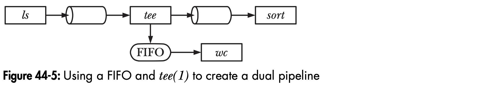

---

<h2 class="custom-center">
	44.8 A Client-Server Application Using FIFOs
</h2>

--

### Design

A service for clients to get unique sequential numbers

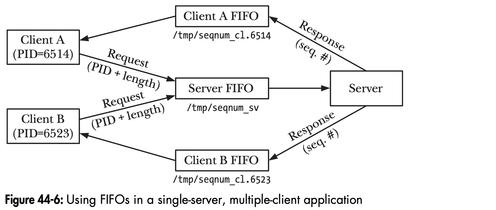

* server (well-known name): /tmp/seqnum_sv
* create FIFO in /tmp
* sender?
    * each client creates FIFO and send the pathname to server
    * **agree on the convention for FIFO pathname** \<--
    the name is built from template CLIENT_FIFO_TEMPLATE with client's PID
* message boundary?
    * delimiter
        * use '\\' with new-line character as boundary
        * cons: need to scan the data to find delimiter
    * fixed-size header with a length field
        * specifying  remaining variable-length component of the message
        * cons: bad length variable
    * **fixed-length messages** \<--
        * simple to program
        * cons: channel capacity is wasted (padded). message can be cutoff if greater than the length specifed
        
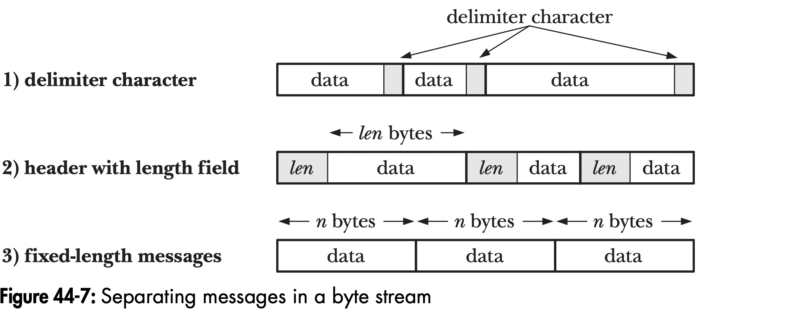

--

Listing 44-6: Header file for fifo_seqnum_server.c and fifo_seqnum_client.c

```cpp [27-30|32-34]
/* fifo_seqnum.h

   Header file used by fifo_seqnum_server.c and fifo_seqnum_client.c

   These programs create FIFOS in /tmp. This makes it easy to compile and
   run the programs. However, for a security reasons, a real-world
   application should never create sensitive files in /tmp. (As a simple of
   example of the kind of security problems that can result, a malicious
   user could create a FIFO using the name defined in SERVER_FIFO, and
   thereby cause a denial of service attack against this application.
   See Section 38.7 of "The Linux Programming Interface" for more details
   on this subject.)
*/
#include <sys/types.h>
#include <sys/stat.h>
#include <fcntl.h>
#include "tlpi_hdr.h"

#define SERVER_FIFO "/tmp/seqnum_sv"
                                /* Well-known name for server's FIFO */
#define CLIENT_FIFO_TEMPLATE "/tmp/seqnum_cl.%ld"
                                /* Template for building client FIFO name */
#define CLIENT_FIFO_NAME_LEN (sizeof(CLIENT_FIFO_TEMPLATE) + 20)
                                /* Space required for client FIFO pathname
                                  (+20 as a generous allowance for the PID) */

struct request {                /* Request (client --> server) */
    pid_t pid;                  /* PID of client */
    int seqLen;                 /* Length of desired sequence */
};

struct response {               /* Response (server --> client) */
    int seqNum;                 /* Start of sequence */
};
```

--

### Server program
Listing 44-7: An iterative server using FIFOs
```cpp []
/* fifo_seqnum_server.c

   An example of a server using a FIFO to handle client requests.
   The "service" provided is the allocation of unique sequential
   numbers. Each client submits a request consisting of its PID, and
   the length of the sequence it is to be allocated by the server.
   The PID is used by both the server and the client to construct
   the name of the FIFO used by the client for receiving responses.

   The server reads each client request, and uses the client's FIFO
   to send back the starting value of the sequence allocated to that
   client. The server then increments its counter of used numbers
   by the length specified in the client request.

   See fifo_seqnum.h for the format of request and response messages.

   The client is in fifo_seqnum_client.c.
*/
#include <signal.h>
#include "fifo_seqnum.h"
int
main(int argc, char *argv[])
{
    int serverFd, dummyFd, clientFd;
    char clientFifo[CLIENT_FIFO_NAME_LEN];
    struct request req;
    struct response resp;
    int seqNum = 0;                     /* This is our "service" */

    /* Create well-known FIFO, and open it for reading */

    umask(0);                           /* So we get the permissions we want */
    if (mkfifo(SERVER_FIFO, S_IRUSR | S_IWUSR | S_IWGRP) == -1
            && errno != EEXIST)
        errExit("mkfifo %s", SERVER_FIFO);
    serverFd = open(SERVER_FIFO, O_RDONLY);
    if (serverFd == -1)
        errExit("open %s", SERVER_FIFO);

    /* Open an extra write descriptor, so that we never see EOF */

    dummyFd = open(SERVER_FIFO, O_WRONLY);
    if (dummyFd == -1)
        errExit("open %s", SERVER_FIFO);

    /* Let's find out about broken client pipe via failed write() */

    if (signal(SIGPIPE, SIG_IGN) == SIG_ERR)    errExit("signal");

    for (;;) {                          /* Read requests and send responses */
        if (read(serverFd, &req, sizeof(struct request))
                != sizeof(struct request)) {
            fprintf(stderr, "Error reading request; discarding\n");
            continue;                   /* Either partial read or error */
        }

        /* Open client FIFO (previously created by client) */

        snprintf(clientFifo, CLIENT_FIFO_NAME_LEN, CLIENT_FIFO_TEMPLATE,
                (long) req.pid);
        clientFd = open(clientFifo, O_WRONLY);
        if (clientFd == -1) {           /* Open failed, give up on client */
            errMsg("open %s", clientFifo);
            continue;
        }

        /* Send response and close FIFO */

        resp.seqNum = seqNum;
        if (write(clientFd, &resp, sizeof(struct response))
                != sizeof(struct response))
            fprintf(stderr, "Error writing to FIFO %s\n", clientFifo);
        if (close(clientFd) == -1)
            errMsg("close");

        seqNum += req.seqLen;           /* Update our sequence number */
    }
}
```

--

### Client program
Listing 44-8: Client for the sequence-number server
```cpp []
/* fifo_seqnum_client.c

   A simple client that uses a well-known FIFO to request a (trivial)
   "sequence number service". This client creates its own FIFO (using a
   convention agreed upon by client and server) which is used to receive a reply
   from the server. The client then sends a request to the server consisting of
   its PID and the length of the sequence it wishes to be allocated. The client
   then reads the server's response and displays it on stdout.

   See fifo_seqnum.h for the format of request and response messages.

   The server is in fifo_seqnum_server.c.
*/
#include "fifo_seqnum.h"

static char clientFifo[CLIENT_FIFO_NAME_LEN];
static void             /* Invoked on exit to delete client FIFO */
removeFifo(void)
{
    unlink(clientFifo);
}
int
main(int argc, char *argv[])
{
    int serverFd, clientFd;
    struct request req;
    struct response resp;

    if (argc > 1 && strcmp(argv[1], "--help") == 0)
        usageErr("%s [seq-len]\n", argv[0]);

    /* Create our FIFO (before sending request, to avoid a race) */

    umask(0);                   /* So we get the permissions we want */
    snprintf(clientFifo, CLIENT_FIFO_NAME_LEN, CLIENT_FIFO_TEMPLATE,
            (long) getpid());
    if (mkfifo(clientFifo, S_IRUSR | S_IWUSR | S_IWGRP) == -1
                && errno != EEXIST)
        errExit("mkfifo %s", clientFifo);

    if (atexit(removeFifo) != 0)
        errExit("atexit");

    /* Construct request message, open server FIFO, and send message */

    req.pid = getpid();
    req.seqLen = (argc > 1) ? getInt(argv[1], GN_GT_0, "seq-len") : 1;

    serverFd = open(SERVER_FIFO, O_WRONLY);
    if (serverFd == -1)
        errExit("open %s", SERVER_FIFO);

    if (write(serverFd, &req, sizeof(struct request)) !=
            sizeof(struct request))
        fatal("Can't write to server");

    /* Open our FIFO, read and display response */

    clientFd = open(clientFifo, O_RDONLY);
    if (clientFd == -1)
        errExit("open %s", clientFifo);

    if (read(clientFd, &resp, sizeof(struct response))
            != sizeof(struct response))
        fatal("Can't read response from server");

    printf("%d\n", resp.seqNum);
    exit(EXIT_SUCCESS);
}
```

---

## 44.9 Nonblocking I/O
Specify `O_NONBLOCK` when open a FIFO

```cpp []
fd = open("fifopath", O_RDONLY | O_NONBLOCK);
if (fd == -1)
    errExit("open");
```

* If the FIFO is being opened for reading, and no process currently has the write end of the FIFO open, then the open() call succeeds immediately ( just as though the other end of the FIFO was already open)
* If the FIFO is being opened FIFO for writing, and the other end of the FIFO is not already open for reading, then open() fails, setting errno to ENXIO

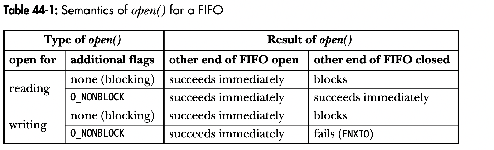

Using the O_NONBLOCK flag when opening a FIFO serves two main purposes:
* It allows a single process to open both ends of a FIFO. The process first opens the FIFO for reading specifying O_NONBLOCK, and then opens the FIFO for writing.
* It prevents deadlocks between processes opening two FIFOs

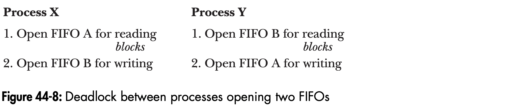

--

### Nonblocking read() and write()
Sometimes, we need to change the state of the O_NONBLOCK flag for a FIFO (or another type of file) that is already open. Scenarios where this need may arise include the following:
* We opened a FIFO using O_NONBLOCK, but we want subsequent read() and write() calls to operate in blocking mode.
* We want to enable nonblocking mode for a file descriptor that was returned by pipe(). More generally, we might want to change the nonblocking status of any file descriptor that was obtained other than from a call to open()—for example, one of the three standard descriptors that are automatically opened for each new program run by the shell or a file descriptor returned by socket().
* For some application-specific purpose, we need to switch the setting of the O_NONBLOCK setting of a file descriptor on and off

Use `fcntl()` to toggle `O_NONBLOCK` open file status flag
```cpp []
// enable
int flags;
flags = fcntl(fd, F_GETFL); /* Fetch open files status flags */
flags |= O_NONBLOCK;        /* Enable O_NONBLOCK bit */
fcntl(fd, F_SETFL, flags);  /* Update open files status flags */
```

```cpp []
// disable
flags = fcntl(fd, F_GETFL);
flags &= ~O_NONBLOCK;       /* Disable O_NONBLOCK bit */
fcntl(fd, F_SETFL, flags);
```

---

## 44.10 Semantics of read() and write() on Pipes and FIFOs


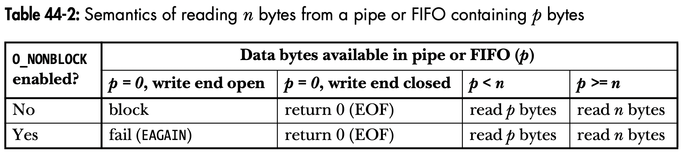


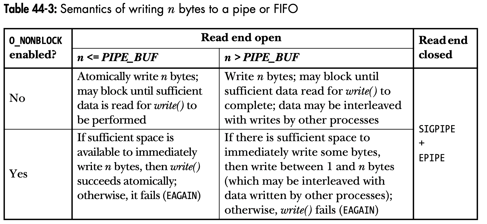
